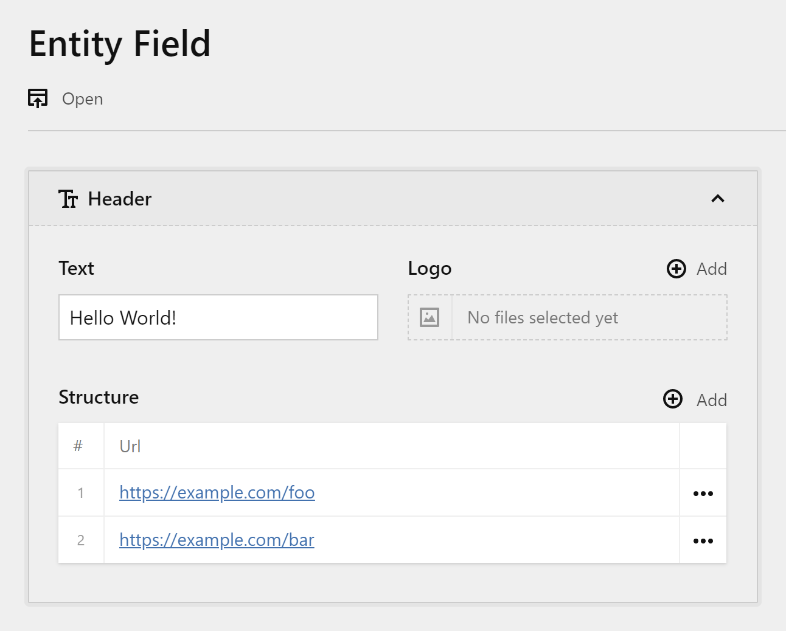

# Kirby Entity Field

Kirby field that allows you to add other fields to it with the intention of scoping them. It works like a Structure with one entry but with much cleaner UI.



## Installation

With [Composer](https://packagist.org/packages/oblik/kirby-entity-field):

```
composer require oblik/kirby-entity-field
```

## Usage

### Field

In the blueprint:

```yml
fields:
  footer:
    type: entity
    fields:
      title:
        type: text
      logo:
        type: files
```

In the template, use the `toEntity()` method:

```php
$footer = $page->footer()->toEntity();
echo $footer->title();
```
